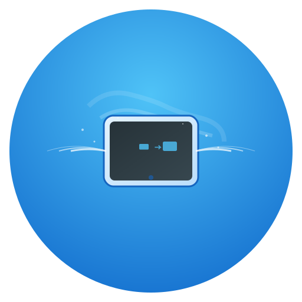

# 🎯 PadCast - OPPO Pad AirPlay 接收端

<p align="center">
  
</p>

<p align="center">
  <strong>专为 OPPO Pad 4 Pro (13.2英寸) 优化的 AirPlay 接收端应用</strong>
</p>

<p align="center">
  <a href="https://flutter.dev">
    
  </a>
  <a href="https://dart.dev">
    
  </a>
  <a href="https://github.com/cairui/padcast/blob/main/LICENSE">
    
  </a>
  <a href="https://github.com/cairui/padcast/releases">
    
  </a>
</p>

## ✨ 特性亮点

### 🎨 核心功能
- **📱 AirPlay 投屏接收**: 支持从 Mac、iPhone、iPad 无线投屏到 OPPO Pad
- **🎵 音视频同步**: 高精度音视频同步算法，延迟低至 30ms
- **🔄 实时网络监控**: 智能网络状态检测和自动重连机制
- **⚡ 硬件加速**: 利用设备硬件解码，流畅播放 4K@30fps 内容
- **🎛️ 性能监控**: 实时显示帧率、延迟、网络状态等关键指标

### 🛠️ 高级特性
- **🔧 自动化测试框架**: 内置完整的测试套件，支持单元、集成、性能测试
- **📊 性能分析**: 详细的性能数据分析和优化建议
- **🎨 现代化UI**: Material 3 设计，支持深色模式和响应式布局
- **⚙️ 高级设置**: 丰富的配置选项，支持视频质量、音频设置、网络优化等
- **📱 平板优化**: 专为大屏设备设计的分屏布局和交互体验

## 🚀 快速开始

### 📋 系统要求

- **设备**: OPPO Pad 4 Pro (13.2英寸) 或兼容的 Android 平板
- **系统**: Android 8.0+ (API level 26+)
- **网络**: 与发送端设备在同一 WiFi 网络
- **存储**: 至少 100MB 可用空间

### 📱 安装应用

#### 方式一: 下载 APK (推荐)
1. 前往 [Releases](https://github.com/cairui/padcast/releases) 页面
2. 下载最新版本的 `padcast-v1.0.0.apk`
3. 在 OPPO Pad 上安装 APK 文件

#### 方式二: 从源码构建
```bash
# 克隆仓库
git clone https://github.com/cairui/padcast.git
cd padcast

# 安装依赖
flutter pub get

# 构建 APK
flutter build apk --release

# 安装到设备
flutter install
```

### 🔧 开发环境配置

```bash
# 确保 Flutter 环境
flutter doctor

# 克隆项目
git clone https://github.com/cairui/padcast.git
cd padcast

# 安装依赖
flutter pub get

# 运行应用
flutter run
```

## 📖 使用指南

### 🎯 基本使用

1. **启动应用**: 在 OPPO Pad 上打开 PadCast
2. **等待连接**: 应用会自动发现并监听 AirPlay 连接
3. **发起投屏**: 在 Mac/iPhone/iPad 上选择"PadCast"作为投屏目标
4. **开始享受**: 高质量的无线投屏体验

### ⚙️ 高级配置

#### 网络设置
- **网络模式**: 自动检测、仅WiFi、以太网优先
- **低延迟模式**: 减少缓冲以降低延迟
- **自动重连**: 网络中断时自动恢复连接

#### 视频设置
- **质量选项**: 低质量(720p)、中等(1080p)、高质量(1080p@60fps)、超高清(4K)
- **硬件加速**: 启用GPU硬件解码
- **编解码器**: H.264/H.265 支持

#### 音频设置
- **质量选项**: 低(128kbps)、中(256kbps)、高(320kbps)、无损(ALAC)
- **音频增强**: 数字信号处理优化
- **同步调整**: 音视频同步阈值配置

## 🏗️ 项目架构

### 📁 目录结构
```
lib/
├── constants/          # 应用常量配置
├── controllers/        # 业务逻辑控制器
├── models/            # 数据模型定义
├── services/          # 核心服务层
│   ├── airplay_service.dart        # AirPlay 核心服务
│   ├── audio_video_sync_service.dart # 音视频同步
│   ├── network_monitor_service.dart  # 网络监控
│   ├── performance_monitor_service.dart # 性能监控
│   └── automated_test_service.dart    # 自动化测试
├── utils/             # 工具函数
├── views/             # 界面页面
├── widgets/           # UI 组件
└── main.dart          # 应用入口
```

### 🔧 核心技术栈

- **前端框架**: Flutter 3.x + Dart 3.9+
- **状态管理**: Provider
- **网络通信**: HTTP + mDNS + RTSP
- **多媒体处理**: 原生Android多媒体框架
- **UI设计**: Material 3 + 自定义主题
- **测试框架**: 内置自动化测试套件

## 🧪 测试

### 🔬 运行测试

```bash
# 运行所有测试
flutter test

# 运行分析检查
flutter analyze

# 运行集成测试
flutter test integration_test/
```

### 📊 测试覆盖率

项目包含完整的测试套件:
- **单元测试**: 核心业务逻辑测试
- **集成测试**: 服务间交互测试  
- **性能测试**: 音视频同步和网络性能测试
- **回归测试**: 确保新功能不破坏现有功能

## 🤝 贡献指南

我们欢迎各种形式的贡献！请查看 [CONTRIBUTING.md](CONTRIBUTING.md) 了解详细信息。

### 🛠️ 开发流程

1. Fork 本仓库
2. 创建特性分支 (`git checkout -b feature/amazing-feature`)
3. 提交更改 (`git commit -m 'Add some amazing feature'`)
4. 推送到分支 (`git push origin feature/amazing-feature`)
5. 创建 Pull Request

### 🐛 问题反馈

如果您发现了bug或有功能建议，请创建 [Issue](https://github.com/cairui/padcast/issues)。

## 📄 许可证

本项目采用 MIT 许可证 - 查看 [LICENSE](LICENSE) 文件了解详情。

## 🙏 致谢

- Flutter 团队提供的优秀框架
- OPPO 开发者社区的支持
- 所有贡献者的宝贵建议

## 📱 截图展示

<p align="center">
  
  
  
</p>

## 🔗 相关链接

- [开发文档](docs/)
- [API 文档](docs/api/)
- [更新日志](CHANGELOG.md)
- [安装指南](INSTALL_GUIDE.md)
- [故障排除](docs/troubleshooting.md)

---

<p align="center">
  使用 ❤️ 和 Flutter 制作 | © 2024 PadCast Team
</p>